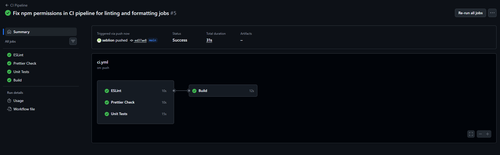

# 🎮 Juego del Ahorcado (Hangman Game)

Juego interactivo del ahorcado desarrollado con HTML, CSS y JavaScript vanilla.

## 📋 Descripción

Este proyecto implementa el clásico juego del ahorcado donde el jugador debe adivinar las letras de una palabra oculta. Con cada intento fallido, se dibuja progresivamente una figura del ahorcado. El juego termina cuando:
- ✅ Se adivina la palabra completa (ganas)
- ❌ Se cometen 6 intentos fallidos (pierdes)

## 🚀 Características

- 🎯 Diccionario de 20 palabras frutas
- 🎨 Visualización gráfica del ahorcado con SVG
- 📊 Contador de intentos fallidos
- ⌨️ Interfaz intuitiva con entrada de letras
- 🎯 Espaciado visual entre letras para mejor legibilidad
- 📱 Diseño responsive con Bootstrap

## 💻 Tecnologías

- HTML5
- CSS3
- JavaScript (Vanilla)
- SVG para gráficos
- Bootstrap 5.3.8

## 🛠️ Instalación y Uso Local

### Requisitos
- Node.js 18 o superior
- npm

### Pasos para ejecutar

1. **Clonar el repositorio**
   ```bash
   git clone <tu-repositorio>
   cd hangman
   ```

2. **Instalar dependencias**
   ```bash
   npm install
   ```

3. **Ejecutar en navegador**
   - Opción 1: Abre directamente `index.html` en tu navegador
   - Opción 2: Usa un servidor local (ej. Live Server)

## 🔄 Pipeline de CI/CD

El proyecto utiliza **GitHub Actions** para automatizar validaciones. El pipeline incluye:

### 1️⃣ **Lint (ESLint)**
- Valida la calidad del código JavaScript
- Detecta errores y malas prácticas
- Ejecuta en cada push y pull request

```bash
npm run lint
```

### 2️⃣ **Format Check (Prettier)**
- Verifica el estilo de código consistente
- Formatea automáticamente según estándares
- Ejecuta en cada push y pull request

```bash
npm run format:check
npm run format  # Para aplicar cambios automáticamente
```

### 3️⃣ **Tests Unitarios (Jest)**
- Ejecuta pruebas unitarias
- Genera reporte de cobertura
- Requiere mínimo 50% de cobertura

```bash
npm test
npm run test:watch  # Modo vigilancia
```

### 4️⃣ **Build**
- Verifica que el proyecto compile correctamente
- Ejecuta después de pasar todas las validaciones anteriores

```bash
npm run build
```

### Flujo del Pipeline

```
Push/PR → Lint → Format Check → Tests → Build
                                      ↓
                              ✅ Aprobado o ❌ Rechazado
```


## 📝 Estructura del Proyecto

```
hangman/
├── .github/
│   └── workflows/
│       └── ci.yml              # Configuración de GitHub Actions
├── hangman.js                  # Lógica principal del juego
├── hangman.test.js             # Pruebas unitarias
├── index.html                  # Interfaz HTML
├── .eslintrc.json              # Configuración de ESLint
├── .prettierrc.json            # Configuración de Prettier
├── jest.config.js              # Configuración de Jest
├── package.json                # Dependencias del proyecto
└── README.md                   # Este archivo
```

## 🎮 Cómo Jugar

1. Se muestra una palabra oculta con guiones bajos (`_ _ _ _`)
2. Ingresa una letra en el campo de entrada
3. Presiona "submit" o Enter
4. Si la letra está en la palabra, se revelará
5. Si no está, se suma un intento fallido y se dibuja una parte del ahorcado
6. Continúa hasta ganar o perder

## 📊 Ejemplo de Ejecución

### Pantalla Inicial
```
Hangman Game

letter: [___]  [submit]

        |---|
        |   |
        |
        |
        |
        |
     ___|___

_ _ _ _ _  _ _ _
Intentos fallidos: 0/6
```

## ✅ Checklist de Validación

- ✔️ Proyecto correctamente subido al repositorio
- ✔️ Pipeline en GitHub Actions configurado
- ✔️ ESLint validando código
- ✔️ Prettier verificando formato
- ✔️ Jest ejecutando tests con cobertura
- ✔️ Build completando exitosamente
- ✔️ Pull Requests con revisiones y aprobaciones
- ✔️ README completo y documentado

## 🐛 Desarrollo

Para hacer cambios al proyecto:

1. Crear rama feature: `git checkout -b feature/mi-cambio`
2. Hacer cambios y validar localmente:
   ```bash
   npm run lint
   npm run format
   npm test
   ```
3. Hacer commit: `git commit -m "Descripción del cambio"`
4. Push a la rama: `git push origin feature/mi-cambio`
5. Abrir Pull Request hacia `develop`
6. Esperar revisión y aprobación de compañeros
7. Fusionar con `develop` y luego a `main`

## 📝 Scripts Disponibles

| Script | Descripción |
|--------|-------------|
| `npm run lint` | Ejecuta ESLint |
| `npm run format:check` | Verifica formato Prettier |
| `npm run format` | Aplica formato Prettier |
| `npm test` | Ejecuta tests con cobertura |
| `npm run test:watch` | Tests en modo vigilancia |
| `npm run build` | Genera build |

## 👥 Autor

Sebastián León, Gregory Salazar

---

**¡Diviértete jugando! 🎯**
